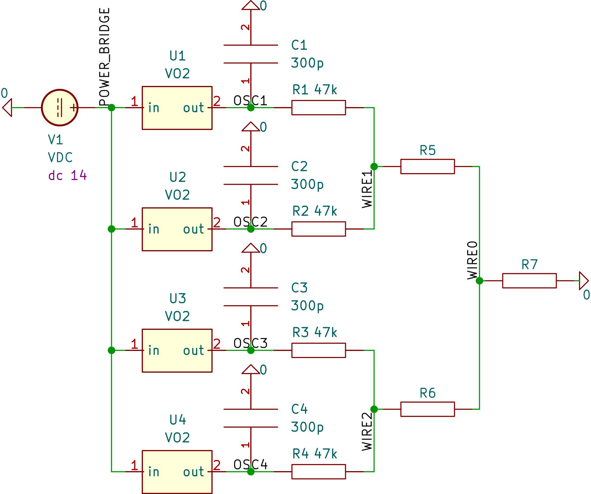

# Function generation from a Sum of Oscillator Signals

This code accompanies a [master thesis](https://fse.studenttheses.ub.rug.nl/id/eprint/31138).

## Abstract

Energy demand in data-intensive applications is an ever-growing concern.
Training a recent large language model consumes energy in the order of hundreds of US households per year.
Remarkably, the human brain is orders of magnitude more energy efficient than modern day digital computers.
Taking inspiration from the brain, the neuromorphic paradigm aims to build more efficient computing systems using analog devices. 

In this work, an ensemble of oscillators is designed and simulated with the goal of arbitrary time-series approximation.
Each oscillator-neuron is formed by a vanadium dioxide memristor in series with a resistor-capacitor (RC) circuit.
Three approaches to simulate an ensemble are developed using the SPICE circuit simulator.
Because the propagation of gradient information through electric circuits is a hard problem, multiple gradient-free optimization algorithms are explored which perturb oscillators' frequency, gain, phase and offset.
We fit a range of real-world and synthetic target functions with varying frequency bands and durations.
Root Mean Squared Error (RMSE) between a target and ensemble signal is used to evaluate fit.
As a benchmark algorithm we rely on linear regression which produces an analytical solution for the choice of circuit parameters.

We show that a vanadium-dioxide oscillator ensemble is suitable for function generation when the target's frequency band lies within the frequency band of the oscillator-neurons.
The approximation of chirp signals is difficult, none of the real-world targets can be fit.
The system benefits from broad phase and frequency diversity.
In contrast, a wide dynamic range leads to exponential loss growth for most algorithms.
Surprisingly, an increase in the number of oscillators tends to increase loss.
Of the gradient-free algorithms, a Las Vegas and a random walk algorithm perform best; they outperform advanced algorithms such as Simulated Annealing, Basin Hopping and Differential Evolution.
We achieve a RMSE of 0.02 with the Las Vegas algorithm, fitting a sine target function of amplitude 1; this is our best result.
Linear regression finds a RMSE that is 13 orders of magnitude smaller.

We identify plateaus and steep steps in oscillators' frequency band as one of two hinderances to better fit.
The strongest argument for this are the diminishing returns in adding oscillators to an ensemble while solving analytically.
Therefore, vanadium-dioxide oscillators alone seem insufficient for realizing an arbitrary function approximator in the frequency domain.
Second, we find that gradient-free algorithms would benefit from negative oscillator gains, as this is where the distribution of circuit parameters between gradient-free algorithms and linear regression primarily differs.

## Requirements

Install [ngspice](https://ngspice.sourceforge.io/download.html) as a SPICE simulator.

Install the required Python libraries.

    # you may want to create a virtual environment first
    pip install -r requirements.txt

Pydot is used with NetworkX for drawing graphs.
Pydot requires GraphViz to be installed.
Installation instructions are found [here](https://graphviz.org/download/).

    # Debian/Ubuntu
    sudo apt install graphviz

## Running

To start the simulation execute

    python src/main.py

For advice on parameters run.

    python src/main.py -h

### Detaching a terminal

Detaching a terminal is useful in order to close a terminal temporarily but being able to resume the terminal later to monitor progress of a simulation.
Some options to do this are `tmux` and `screen`, where `tmux` is more modern.
Instructions are geared towards Debian and Ubuntu hosts.

Install requirements

    sudo apt install tmux

Start tmux session

    tmux

Run desired commands, start simulation

    python src/main.py

Detach tmux

    # press Ctrl + b
    # press d

Now the terminal running tmux can be closed or an SSH connection to a host can be terminated

To reattach a session

    tmux ls # to list sessions
    tmux attach-session -t <session-name>

Multiple sessions can be run by detaching with

    # press Ctrl + b
    # press $
    # enter session name

### Deployment on Slurm (High Performance Computing cluster)

First prepare a job according to <https://wiki.hpc.rug.nl/habrok/job_management/running_jobs>.
Complete job files are in the `scripts` directory.

Start a job; make sure the script is executed from the same directory as done during testing.

    cd path/to/project
    sbatch peregrine_job.sh

List active jobs.

    squeue -u $USER
    
Get information about a running job.

    jobinfo JobID

## Testing

Static code analysis.

    # easy-going
    pyflakes src/
    # pedantic
    pylint --errors-only src/

Docstrings.

    # easy-going
    pydocstyle src/ --add-ignore=D103,D104,D105,D106,D107,D202,D400,D403
    # pedantic
    pydocstyle src/

Formatting.

    black src/ -l 100

Static type checking.

    mypy src/

Unit tests.

    pytest src/tests